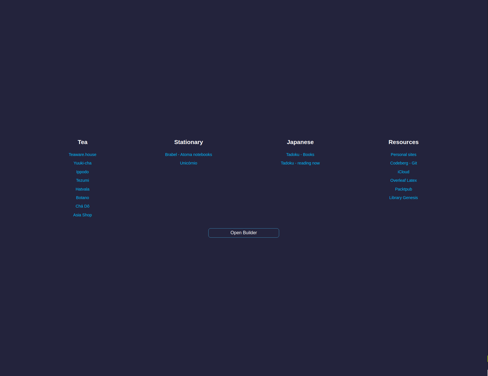
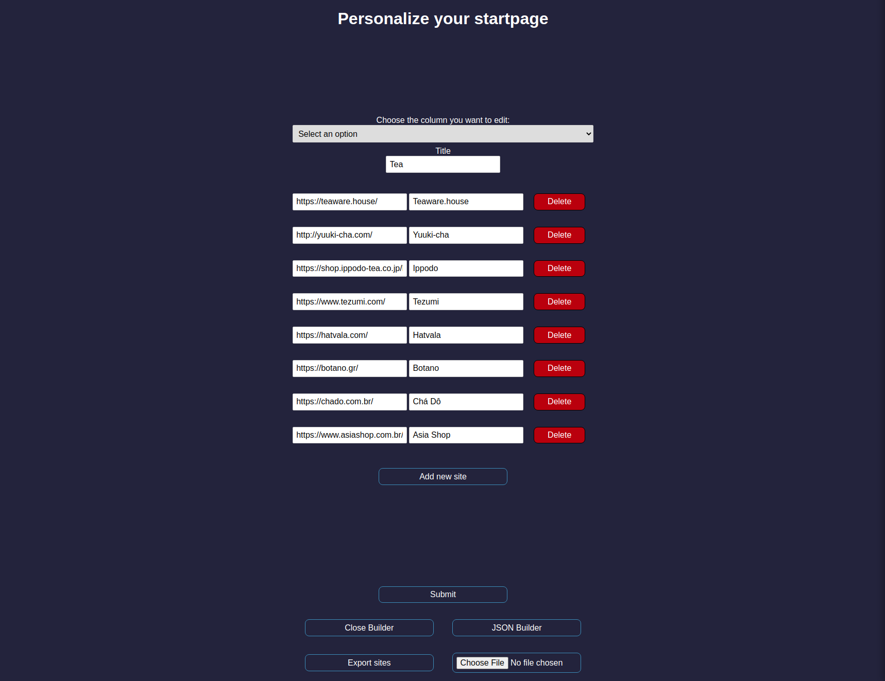
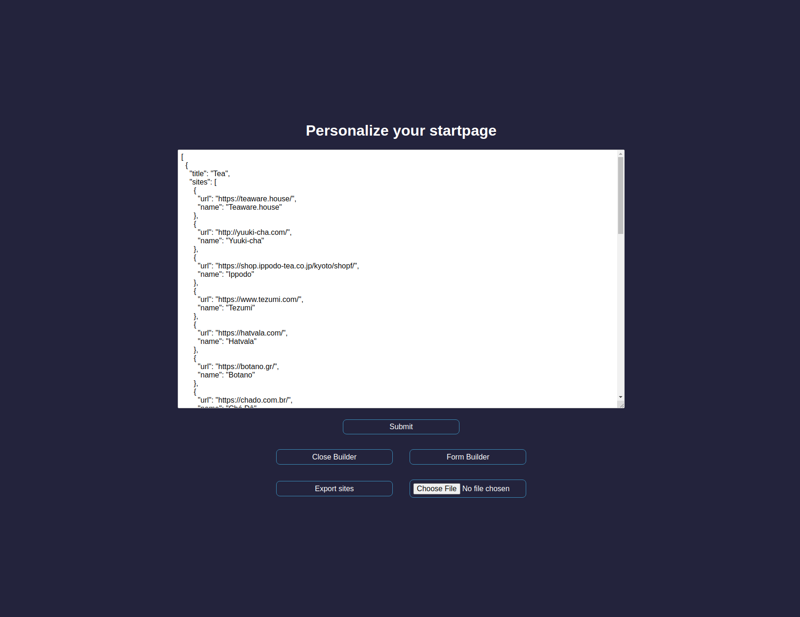

# Dynamic StartPage

Web app made to store links and separate them based on columns. It features two different editors, one based on formularies and another based on a text editor.

The app uses your browser's local storage instead of a backend to keep the links. To handle the data not being accessible everywhere, the app has an export/import feature that lets you save your sites as a JSON file.

 

Form editor:

JSON editor:

